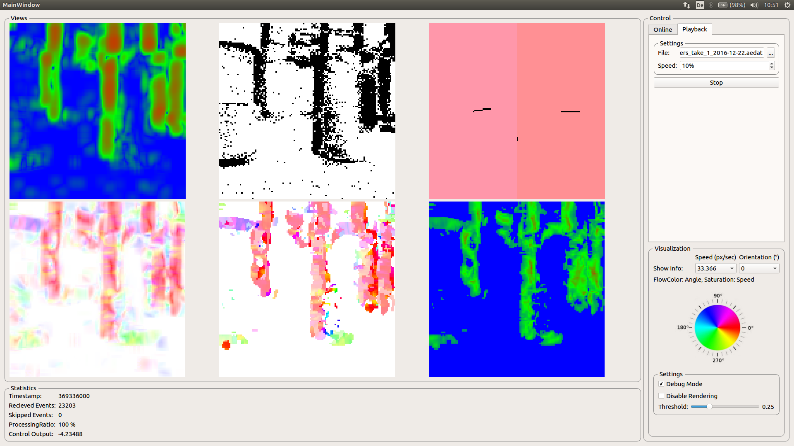
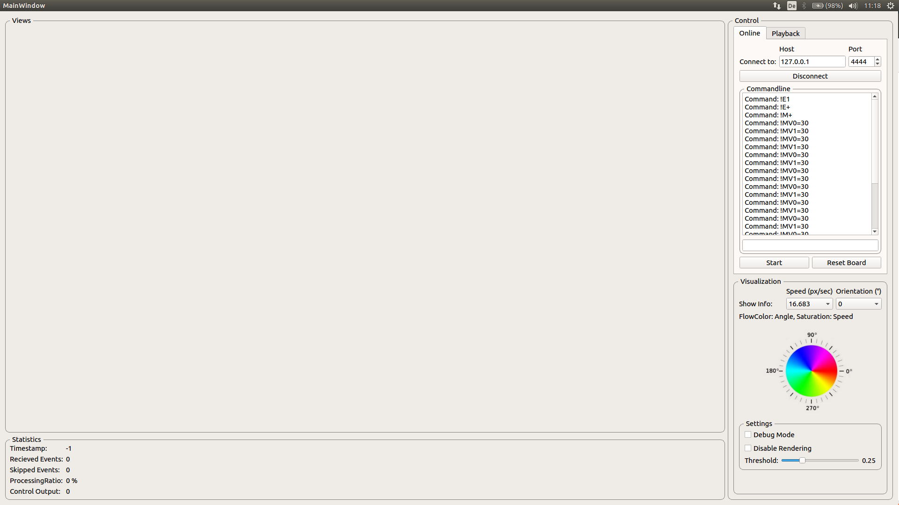

# Visual Information Processing Project Seminar

This Repository contains my code for the Visual Information Processing Project Seminar at University Ulm, Germany.

My tasks:
- Implement an optic flow estimator by using event-based DVS cameras according to this paper \[1\].
- Use the optic flow to control a small robot platform by biological inspired algorithms \[2\].

# Implementation Overview
The host software based on Qt communiates with the PushBot (eDVS) and computes the optic flow and the steering commands. The optic flow is used to manage the navigation of the push bot. In a first attempt I am going to implement the basic processing software (optic flow estimator) in MATLAB to speed-up prototyping.

The eDVS firmware recognices commands to control the camera and the motors. The firmware is able to stream the DVS events in differnt formats over WLAN.

# Implementation Details
Filled with information when the project is done. :)

# User Interface
## Playback mode
In Playback mode the software is able to process DVS events from a ".aedat" file. The software plays the data in realtime by simulating the exact delta between timestamps or it slows down the playback of the file down to a rate of 1 percent of the real time.

The UI shows currently 6 figures when debug mode is enabled. From top to bottom, left to right.
 - Energy of the specific motion energy estimator responsible for a fixed speed and orientation. (Comboboxes on the right panel)
 - OpticFlow for a fixed speed, specified by the combobox on the right. HSV-Color model used for visualization. The hue encodes the dominant orientation for each pixel. The saturation encodes the energy normalized to approx. 1.
 - The next figure shows the events (black pixels) involved into the computation for the selected speed. The amount of black pixels depends on the timewindow of the selected filter speed.
 - Actual optic flow, combined from the motion energy of all filters. The hue indicates the flow direction and the saturation indicates the speed. Higher saturation equals higher speeds.
 - Shows the averaged optic flow in the left and right image half (color encoded and as line). Below the center of the image, the error between both image halfs, used to compute the steering signal, is shown.
 - The last figure shows the normalized energy of the combined optic flow. This figure can be used as propability of the computed optic flow.

Figures 4 to 6 are only generated when debug mode on the bottom right is enabled.

## Online mode
The online mode is similar to the playback mode but reads the events from a  pushbot connected per WLAN. In online mode the pushbot controller generates steering commands and sends them to the robot.

The image below shows the user interface. This time, the user has to specify the pushbots ip address and the port. After clicking connect, a simple commandline is enabled. The commands entered in the textfield below are send to the pushbot when the user hits enter.

The start button below the textfield enables the event streaming and starts the system to process the incoming event data.

This time, the computed steering signal is transmitted to the pushbot and the commands are shown in the commandline.

## eDVS Streaming Formats
The eDVS chip streams the events in the following formats. The event always contains two bytes as shown in E0. The first byte contains the 7 bit Y-coordinate and a leading 1. The second byte contains the polarity (on = 0, off = 1) and the 7 bit X-coordinate. The optional timestamps have a resolution of 1us.

- E0: default, no timestamp -> 1yyyyyyy.pxxxxxxx
- E1: additional delta timestamp with 1 to 4 bytes (only 7 bits each, leading bit = 1 indicates last timestamp byte)
- E2: fixed 16 bit absolute timestamp --> 1yyyyyyy.pxxxxxxx.tttttttt.tttttttt
- E3: 16/32 bit absolute timestamp

# Resources
- Discussion where a user tries to read eventy via UART:
https://sourceforge.net/p/jaer/discussion/631958/thread/3fd5df33/
- Short description of the eDVS and usage examples:
https://wiki.lsr.ei.tum.de/nst/programming/edvsgettingstarted
- Matlab scripts to process eDVS data:
https://wiki.lsr.ei.tum.de/nst/programming/edvsmatlabscripts
- Embedded Dynamic Vision Sensor (eDVS) and PushBot:
  - http://inilabs.com/support/hardware/edvs/
  - http://inilabs.com/support/software/
- DVS data sets for testing:
 http://www2.imse-cnm.csic.es/caviar/MNISTDVS.html

# Bibliography

1. "On event-based optic flow detection", Tobias Brosch, Stephan Tschechne, Heiko Neumann, April 2015
2. "Visual control of navigation in insects and its relevance for robotics", Mandyam V Srinivasan, 2011
