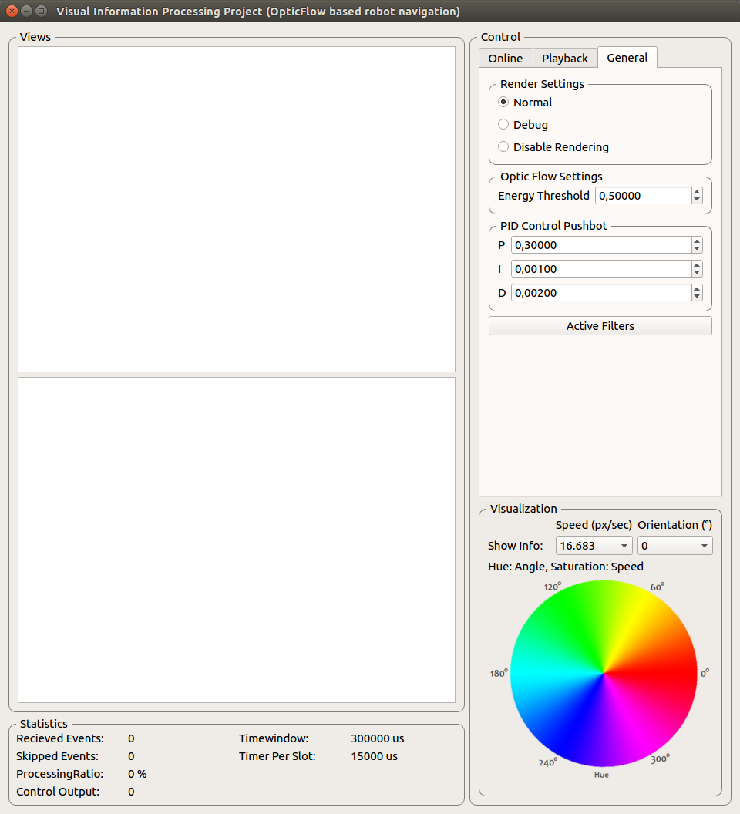

# Visual Information Processing Project Seminar

This Repository contains my code for the Visual Information Processing Project Seminar at University Ulm, Germany.

My tasks:
- Implement an optic flow estimator by using event-based DVS cameras according to \[1\].
- Use the optic flow to control a small robot platform by biological inspired algorithms \[2\].

The implemented system and the results are described in detail in [this PDF](Doc/elaboration.pdf).

# Screenshots

